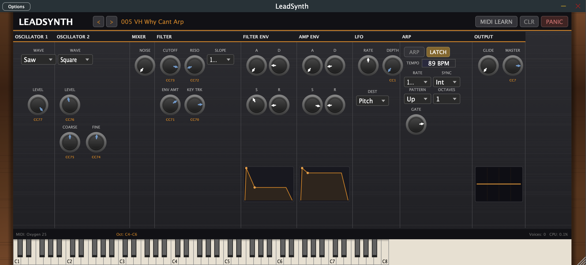

# LeadSynth

Virtual analog polyphonic synthesizer inspired by the legendary Moog synthesizers, Prophet synthesizer family by Sequential, and Oberheim.

Created by Jarmo Annala.



## Overview

LeadSynth is a software synthesizer built with JUCE/C++ that recreates the warm, rich character of classic analog polysynths. It runs as a standalone macOS app or as a VST3/AU plugin in any compatible DAW.

### Sound Engine

- **Dual oscillators** with selectable waveforms (Sine, Saw, Square, Triangle) using polyBLEP anti-aliasing
- **Oscillator 2 detune** with coarse (+-24 semitones) and fine (+-100 cents) control
- **White noise generator** with level control
- **Multi-mode ladder filter** — switchable between 12 dB/oct (Oberheim-style) and 24 dB/oct (Moog-style) with cutoff, resonance, envelope amount, and key tracking
- **Dual ADSR envelopes** — independent filter and amplitude envelopes with real-time visualization
- **LFO** with rate, depth, and selectable destination (pitch, filter, or both)
- **Glide/portamento** with adjustable time
- **8-voice polyphony**

### Arpeggiator

- **Patterns:** Up, Down, Up/Down, Random
- **Rate divisions:** 1/4, 1/8, 1/8T (triplet), 1/16, 1/16T, 1/32
- **Tempo:** Internal BPM (30-300) or host sync
- **Latch mode:** Notes sustain after release; new notes replace when all keys released
- **Octave range:** 1-4 octaves
- **Gate length:** 5%-100%
- All arp settings saved per preset

### Factory Presets

| # | Name | Group | Inspired by |
|---|---|---|---|
| 001 | Analog Lead | Classic | Pink Floyd / MMEB |
| 002 | VH Jump Brass | Van Halen | "Jump" — Oberheim OB-Xa |
| 003 | VH Ill Wait Pad | Van Halen | "I'll Wait" — Oberheim OB-Xa |
| 004 | VH Why Cant Lead | Van Halen | "Why Can't This Be Love" — OB-Xa |
| 005 | VH Why Cant Arp | Van Halen | "Why Can't This Be Love" arp — OB-Xa |
| 006 | OB Brass | Classic | Oberheim brass |
| 007 | Moog Lead | Classic | Moog prog lead |
| 008 | OB Strings | Classic | Oberheim string pad |
| 009 | Prophet Lead | Classic | Sequential Prophet-5 |
| 010 | Analog Bass | Classic | Moog bass |
| 011 | KR Arp Seq | Knight Rider | Roland Jupiter-8 arpeggio |
| 012 | KR Brass | Knight Rider | Oberheim OB-X brass |
| 013 | KR Chords | Knight Rider | Sequential Prophet-5 chords |
| 014 | KR Deep Bass | Knight Rider | Moog Minimoog bass |
| 015 | KR Lead | Knight Rider | Roland Jupiter-8 lead |
| 016 | KR Odyssey | Knight Rider | ARP Odyssey |

### UI Features

- Custom analog-style UI with wood side panels, brushed metal faceplate, and metallic pointer knobs
- Real-time ADSR envelope visualization (amber curves)
- Real-time oscilloscope with 70s CRT phosphor aesthetic
- On-screen piano keyboard with computer keyboard input (two octaves)
- Preset browser with groupings and inspirations (click preset name)
- Resizable window with locked aspect ratio
- Kiosk/fullscreen mode
- Footer bar showing MIDI device, active octave range, voice count, and CPU load

### MIDI Learn

- Click **MIDI LEARN** to enter learn mode (knobs turn green)
- Click any knob, then move a CC on your controller to assign it
- Assigned knobs show a **blue tint** and CC number label
- Mappings are saved per MIDI controller device and persist across sessions
- **CLR** removes all CC mappings

### Computer Keyboard Layout

Two octaves mapped to the QWERTY keyboard:

```
Lower octave (black):     S  D     G  H  J
Lower octave (white):   Z  X  C  V  B  N  M
                        C  D  E  F  G  A  B

Upper octave (black):     2  3     5  6  7
Upper octave (white):   Q  W  E  R  T  Y  U  I
                        C  D  E  F  G  A  B  C
```

Click the piano keyboard to give it focus, then play.

## Keyboard Shortcuts

| Key | Action |
|---|---|
| Left / Right | Previous / next preset |
| Up / Down | Octave up/down (when keyboard focused) or preset switch |
| F | Toggle fullscreen (kiosk mode) |
| S | Panic — stop all sounding notes |
| Escape | Return focus from keyboard to main editor |

## Requirements

- macOS with Xcode Command Line Tools
- CMake (install via `brew install cmake`)
- [JUCE Framework](https://github.com/juce-framework/JUCE) — cloned into the project root as `JUCE/`

## Building

### Quick Start

```bash
# Clone JUCE (if not already present)
git clone --depth 1 https://github.com/juce-framework/JUCE.git

# Build everything
./scripts/build-all.sh

# Run standalone
open build/LeadSynth_artefacts/Release/Standalone/LeadSynth.app
```

### Build Scripts

| Script | Description |
|---|---|
| `scripts/build-all.sh` | Build all targets (Standalone, VST3, AU) |
| `scripts/build-standalone.sh` | Build standalone app only. Pass `--run` to launch after build |
| `scripts/install-plugins.sh` | Build and install VST3 + AU to system plugin folders |
| `scripts/clean.sh` | Remove build directory |

### Build Outputs

| Target | Path |
|---|---|
| Standalone | `build/LeadSynth_artefacts/Release/Standalone/LeadSynth.app` |
| VST3 | `build/LeadSynth_artefacts/Release/VST3/LeadSynth.vst3` |
| AU | `build/LeadSynth_artefacts/Release/AU/LeadSynth.component` |

### Plugin Installation

```bash
./scripts/install-plugins.sh
```

Copies to `~/Library/Audio/Plug-Ins/VST3/` and `~/Library/Audio/Plug-Ins/Components/`. Restart your DAW after installing.

## Project Structure

```
lead_vst/
├── Source/
│   ├── PluginProcessor.h/cpp    # Audio engine, parameter system, state
│   ├── PluginEditor.h/cpp       # UI, layout, visualizations
│   ├── SynthVoice.h/cpp         # Per-voice DSP (oscillators, filter, envelopes)
│   ├── Oscillator.h             # Band-limited oscillator (polyBLEP)
│   ├── LadderFilter.h           # Multi-mode ladder filter (12/24 dB)
│   ├── Arpeggiator.h            # Lock-free arpeggiator engine
│   ├── SynthLookAndFeel.h       # Custom knob and UI rendering
│   ├── MidiLearnManager.h       # Lock-free CC-to-parameter mapping
│   ├── SettingsManager.h        # Per-device settings persistence
│   ├── PresetManager.h          # Factory preset definitions
│   └── StandaloneApp.cpp        # Custom standalone app with macOS menu
├── Assets/
│   ├── icon_1024.png            # App icon source
│   ├── LeadSynth.icns           # Multi-resolution macOS icon
│   └── KnightRider_LeadSynth.mid # Knight Rider MIDI arrangement
├── scripts/                     # Build and install scripts
├── JUCE/                        # JUCE framework
└── CMakeLists.txt               # Build configuration
```

## License

All rights reserved. This is a private project.
